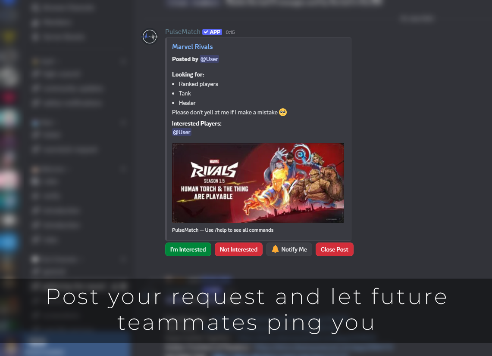
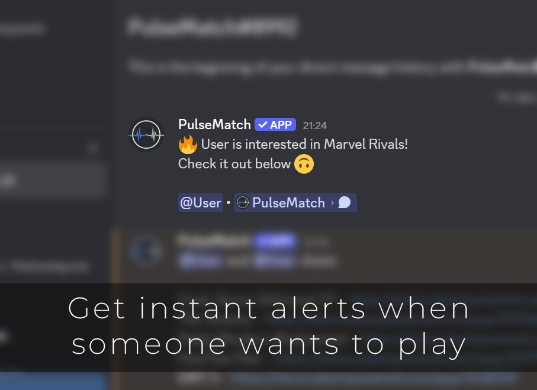
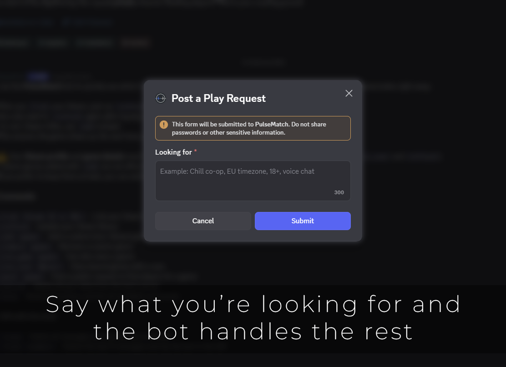
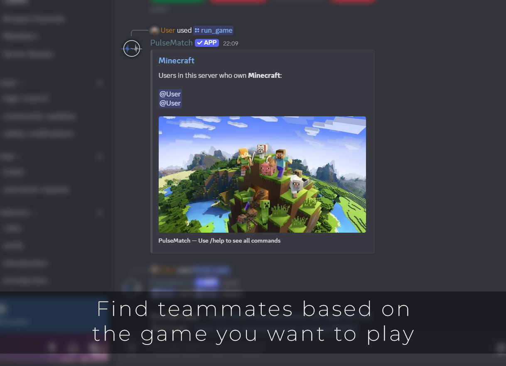
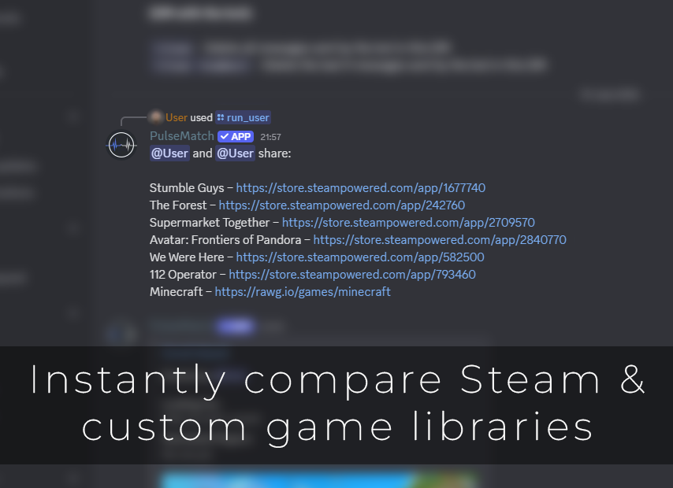

  

<h1 align="center">PulseMatch Discord Bot</h1>

<b>PulseMatch</b> makes game nights effortless by showing which Steam games you and your friends share.  
You can instantly see who owns what or create a post with <code>/post</code> to find teammates right away.

&nbsp;

# **Overview**

🎮 **Instant game checks**  
Find who owns a specific title, or compare libraries with up to 10 friends at once to see what you can all play together.

🤝 **Find teammates with `/post`**  
Create a public post for any game. Friends can mark interest, you get notified, and posts expire after 24 hours.

➕ **Non-Steam games supported**  
Add titles like Minecraft or Valorant manually. They work the same as Steam games in comparisons and posts.

🔔 **Smart notifications**  
Enable alerts and get a DM when someone joins your play request. No spam, just the signals that matter.

📬 **DM results**  
Long lists are sent to your DMs with page buttons for easy browsing.

🛡️ **Private and simple**  
No Steam login required. Just link your profile, refresh your library, and you're done.  
Your data stays local to the bot.

&nbsp;

# **Instructions**

1.  `/link <Steam profile URL>` your Steam profile URL.
2.  `/refresh` your library.
3.  Done!

&nbsp;

⚠️ **BEFORE REFRESHING (Important):**

For the bot to see your games, your **Steam Privacy Settings** must be set to:

* **My Profile** | *Public*
* **Game Details** | *Public*
* **Always keep my total playtime private** | *UNCHECKED*

📍 **Navigation:** `[USERNAME]` > `Profile` > `Edit Profile` > `Privacy Settings`

&nbsp;

> [!TIP]
> You can switch these back to *Private* after the `/refresh`.

&nbsp;

# **Installation**

Choose one of the options below to add **PulseMatch** to your Discord server:

**OR**

&nbsp;

# **Screenshots**

&nbsp;

# **Commands**

`/link <Steam profile URL>` - Link your Steam account

`/refresh` - Update your Steam library (Run only after buying new games)

`/add <game>` - Add a custom (non-Steam) game

`/remove <game>` - Remove a custom game

`/owners <game>` - See who in the server owns a game

`/compare` - Find games everyone can play together (up to 10 players)

`/post <game>` - Create a "Looking for Group" request

`/unlink` - Delete **ALL** your data (Irreversible)

`/help` - Show instructions and list all available commands

&nbsp;

**DM Commands (Send to Bot in Direct Message):**

`!clear` - Delete all bot messages in DM

`!clear <number>` - Delete the last X bot messages

&nbsp;

# **Legal**

📜 [Privacy Policy](./privacy_policy.md)  
📘 [Terms of Service](./terms_of_service.md)

&nbsp;

# **Support**

PulseMatch's core features are free and they'll stay that way. If it's made your game nights easier and you'd like to support development and server costs, you can do so here:

Thank you! ❤️
